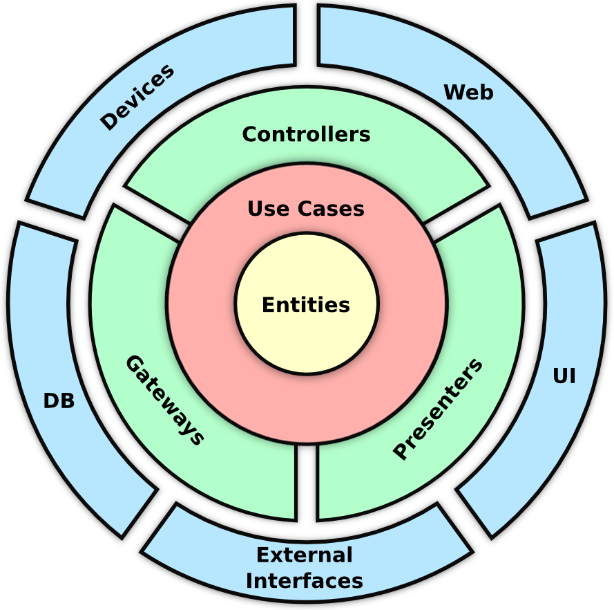

# Forum System 📝

It is a forum application built to practice DDD (Domain Driven Design) and Clean Architecture concepts.

### Topics
- [Summary of concepts](#summary-of-concepts)
- [Usage](#usage)
---

### Summary of concepts

**Domain Driven Design** is a software design methodology that highlights the understanding of the application domain, which is the area in which the software will be applied. 

Studying about DDD, you will come across some terms, such as *Domain Experts*, *Ubiquous language*, *Value Objects*, *Domain Events*, etc. So, to learn more about each of them, I did this project proposed in Rocketseat's NodeJS course. 

However, as DDD is just a software design methodology and not a software architecture, I had to base myself on some implementation approach and the choice was **Clean Architecture**.

**Clean Architecture** brings an approach to building a testable, maintanable and flexible code. This architecture suggests a division of layers in your project:

- **Domain**: Where the enterprise rules are, such as their **entities**, relationships and **events**;
- **Application**: Where the business rules are, such as **use cases** and contracts (repositories and providers **interfaces**);
- **Infrastructure**: Where are the implementation of external requirements for your application, such as **database**, external APIs or other services.

<div style="display: flex; justify-content: center">
	
</div>

Each layer of the project must respect the principles of **SOLID** and each one has its own level of decoupling. Consider the domain as the core of your software, so it must be completly independent. The use cases use the domain, but must not depend on any infrastructure implementation, only on interfaces (Principle of Dependency Inversion). Finally, infrastructure implementations must respect contracts created in the application's internal layers.

In the Forum application, I developed just the Domain and Application layers without any framework dependency, using only Vitest to run tests and DayJS to manipulate date objects in my application.

---

### Usage

First, you have to get repository. Use following command in terminal:
```bash
git clone https://github.com/rodrigo-orlandini/forum-ddd.git
```

And install package dependencies:
```bash
npm i
```

Now, you already be able to run application tests:
```bash
npm run test
```

NOTE: As the application has not infrastructure layer, there is no exposed way to access it.
